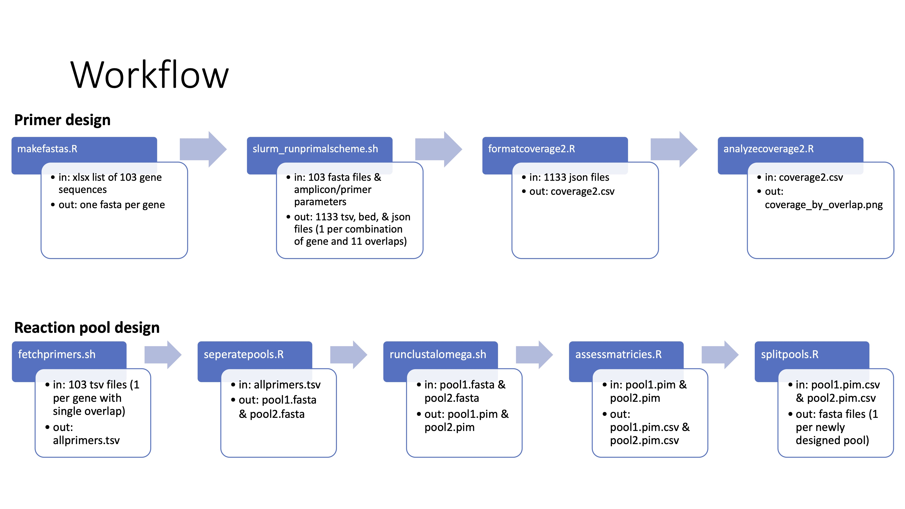

# Multiplexing PrimalScheme AmpSeq

## Proposal and description

This is a workflow to produce well-designed primer pools for Fluidigm multiplexing on a 48.48 access array from the output of primal scheme and clustal omega. It should work generally for any similar multiplexing ampseq process by adjusting relevant parameters like pool size, amplicon length, and overlap.

Input data is a list of fasta files containing genomic sequences, typically genes and flanking regions, and relevant design parameters for the ampseq system. Output will include a list of predicted amplicons, the primers to generate those amplicons, and the relevant positional information and reaction specifications.

R scripts will handle most of the data transformation. Shell scripts are used for execution of scripts and some data gathering processes. A major component, primalsceme, is run inside a singularity shell and requires execution via SLURM. I am planning to use Snakemake to easily run all the components. Alternatively, I may use a shell script. The *Workflow Summary* section below goes into more detail about the purpose of each script.

Some areas require substantial work to make this perform as a polished pipeline. First, I have never used Snakemake and don’t know how it might work or be executed. Second, part of my workflow requires using Clustal Omega, which I have been accessing via a web portal. I don’t know if I will be able to automate web portal access and results retrieval. Alternatively, I believe clustal omega can be run as a script, but I’d probably have to set it up in Singularity. Third, designing the pipeline to be flexible for a wide range of parameters could be tricky. So for I have only tested parts of this workflow on a very narrow set of parameters specific to the Fluidigm 48.48 access array and illumina sequencing. I also have only tested it on a carefully selected set of genomic regions. I have no good ideas how to handle exceptions gracefully at this time, other than simply exiting and reporting the exceptions when possible.


## Workflow Summary



1. Clustering of homologous sequences

   1. Generate a list of genomic sequences as fasta files.
   2. Submit to Clustal Omega. 
   3. Use tree to group highly related sequences. Currently a manual process.
   4. Each group or ungrouped individual sequences get their own fasta files.

2. Primer generation ([more detail](primalscheme/README.md))

   1. Submit each fasta file to primal scheme with desired parameters using `runprimalscheme.sh`. This uses SLURM and a Singularity shell.
   2. Extract and prepare the coverage log summary and produce visusuals using
      1. `grepcoverage.sh`  pulls coverage information from output files of primalscheme.
      2. `formatcoverage.R`  improves readability and formatting of the coverage data from primalscheme.
      3. `analyzecoverage.R` produces visual analysis of the results from primalscheme. Useful for determining if primalscheme did a good job designing amplicons given the set of constraining parameters. May help selection of best set of parameters to use for amplicon design.

3. Design of fluidigm pools ([more detail](fluidigm_pool_design/README.md))

   1. Retrieve full list of primers using `fetchprimers.sh`
   2. Separate primers into two pools based on overlap as specified by primal scheme using ` separatepools.R`
   3. Submit each pool to clustal omega.
   4. Generate pairwise comparison of primer identity using `assessmatricies.R`
   5. Split primary pools (designed by primalsceme) into secondary and tertiary pools to minimize identity while keeping pairs together. `splitpools.R`

   

## TODO

- [x] write up the basic scope, design, and expected behaviour.
- [x] copy over those files that are relevant to this improved version.
- [x] add access to data inputs, probably by coping the data into a subdirectory in this repository.
- [x] Reconfigure PrimalScheme
  - [x] Download [PrimalScheme repo](https://github.com/aresti/primalscheme)
    - In OSC.
  - [ ] Modify *T*~m~ parameters (60-68º or find way to let user specify at runtime)
    - [@quick2017](https://www.nature.com/articles/nprot.2017.066) recommends *T*~annealing~ > 65º and long annealing times
      - I think that is the temperature for the PCR annealing step?
      - In the `config.py` file: *T*~m_min~ = 59.5º; *T*~m_max~ = 62.5º; *T*~m_optimal~ = 61.0º;  
    - @qiagen2016 recommends *T*~m~ ≥ 68º
  - [x] Install and get working
    - [ ] ~~Set up in Singularity or Docker shell~~
    - I’m not sure I actually need to set it up in virtualization shell. It’s all python so I should be able to run it in a python environment.
    - [x] Installed with Python Virtual enviornment instead of Docker/Singularity
   - [x] Set up code for execution via SLURM.
    - [x] Test output
- [ ] Allow specification of which genes/genomic sequences to use for primer generation.
  - Priority list of genes [here](gene_clustering/reduced_genes_list_27nov2020.xlsx)
  - [ ] Reduce further to:
    - Rubber genes
      - CPT2
    - Ones from the paper (Zinan Luo paper) ?
    - Flowering time
      - FT
      - FLC
    - delay in germination (DOG1)
    - Self incompatibility
      - 4 candidates, but one may be best candidate.
- [ ] add functionality to split pools designed by primal scheme into pools designed for multiplexing with the 48.48 access array.
  - no more than 10 primer pairs in any well on the daughter plate
  - no more than 80 primer pairs in any columb on the daughter plate (and 80 total on the mother plate, leaving the last two columns empty for buffers)
  - each multiplexing pool avoids overlapping amplicons.
  - extra space for primers in any pool can be filled with gSSRs or other kinds of markers.
    - may require running primal scheme on these gSSRs.
  - recommendations from Fluidigm to not to combine primers that are close to each other on the genome (separated by 5Kb) within each pool and to check in silico for primer dimer formation and priming within PCR products for each pool.
- [ ] improve flow with Snakemake or a Shell script.

## Notes

### Local paths so I don’t forget

```bash
# OSC
/fs/scratch/PAS1755/drw_wd/Primal-to-Fluidigm

# Personal computer
/Users/$USER/Documents/GitHub/MPAS
```

